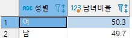
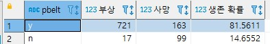

1. 전체 교통사고 부상/사망 비율
```sql
SELECT format(sum(injury)/sum(injury+dead)*100,1) AS '부상자 비율', 
format(sum(dead)/sum(injury+dead)*100,1) AS '사망자 비율' 
FROM trfacd_status
```


2. 각 교통사고 별 부상/사망 비율
```sql
SELECT trfacd_type, 
format(sum(injury)/sum(injury+dead)*100,1) AS '부상자 비율', 
format(sum(dead)/sum(injury+dead)*100,1) AS '사망자 비율'
FROM trfacd_status GROUP BY trfacd_type
```


3. 전체 교통사고 성비율
```sql
SELECT psex "성별" ,(count(psex) / (SELECT count(*) FROM trfacd_prt)*100) AS "남녀비율" FROM trfacd_prt
GROUP BY psex
```


4. 안전벨트 착용 유무에 따른 부상/사망과 생존확률
```sql
(SELECT pbelt, count(pcasualty) "부상", (SELECT count(pcasualty) "사망"
FROM trfacd_prt
WHERE pbelt = "y" AND pcasualty = '사망') AS "사망", count(pcasualty)/(count(pcasualty)+
(SELECT count(pcasualty) "사망"
FROM trfacd_prt
WHERE pbelt = "y" AND pcasualty = '사망')) * 100 AS "생존 확률"
FROM trfacd_prt
WHERE pbelt = "y" AND pcasualty = '부상'
GROUP BY pbelt)
UNION
(SELECT pbelt, count(pcasualty) "부상",
(
SELECT count(pcasualty)
FROM trfacd_prt
WHERE pbelt ="n" AND pcasualty = "사망"
) AS "사망",
count(pcasualty)/(count(pcasualty) + (
SELECT count(pcasualty)
FROM trfacd_prt
WHERE pbelt ="n" AND pcasualty = "사망"
)) *100
FROM trfacd_prt
WHERE pbelt ="n" AND pcasualty = "부상" 
GROUP BY pbelt)
```
