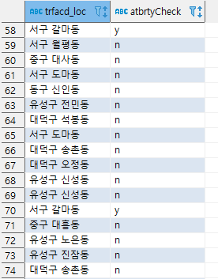
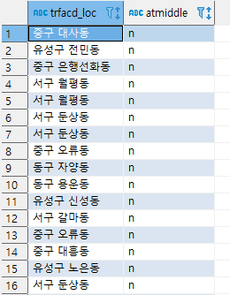
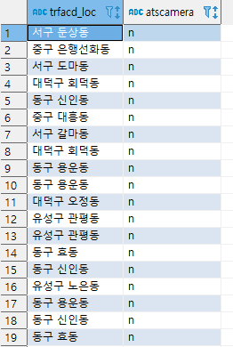
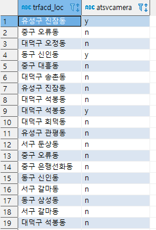
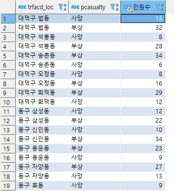
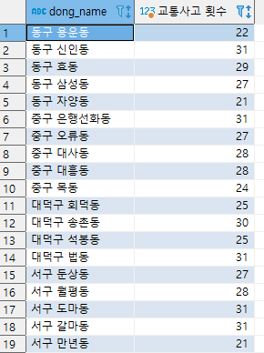

# 목표

1. 안전벨트 미착용 -> 부상/사망 여부 확인

2. 음주운전 사고 발생지의 음주단속 여부 확인
```sql
select t.trfacd_loc,a.atbrtyCheck from area_trfacd as a
inner join trfacd_info as t
on a.trfacd_mngno = t.trfacd_mngno
where t.trfacd_type = "음주운전"
```


3. 중앙선 침범 사고 발생지의 중앙 분리대 여부 확인
```sql
select t.trfacd_loc, a.atmiddle
from area_trfacd as a inner join trfacd_info as t 
on a.trfacd_mngno = t.trfacd_mngno where t.trfacd_type = "중앙선침범"
```


4. 과속 사고 발생지의 과속 카메라 여부 확인
```sql
select t.trfacd_loc, a.atscamera
from area_trfacd as a inner join trfacd_info as t 
on a.trfacd_mngno = t.trfacd_mngno where t.trfacd_type = "과속"
```


5. 신호위반 사고 발생지의 신호위반 카메라 여부 확인
```sql
select t.trfacd_loc,a.atsvcamera 
from area_trfacd as a
inner join trfacd_info as t on a.trfacd_mngno = t.trfacd_mngno where t.trfacd_type = "신호위반"
```


6. 각 지역별 교통사고 부상자, 사망자
```sql
SELECT trfacd_loc,t.pcasualty ,count(t.pcasualty) AS "인원수"
from trfacd_info as a
inner join trfacd_prt as t
ON t.trfacd_mngno  = a.trfacd_mngno  GROUP BY t.pcasualty  , trfacd_loc ORDER BY trfacd_loc
```



7. 사고 다발 지역 조회
```sql
SELECT a.dong_name, count(*) AS "교통사고 횟수" 
FROM area_trfacd AS a
INNER JOIN trfacd_info AS t ON a.trfacd_mngno  = t.trfacd_mngno 
GROUP BY a.dong_name 
HAVING  count(a.dong_name) > 20
```



